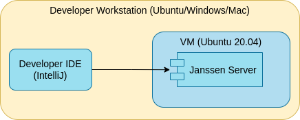

# Run Janssen integration tests on developer machine

In this guide, we will look at steps to run the Janssen integration test suite against a locally installed Janssen server on developer machine.

## Table of Content

- Configure the Janssen server for tests
- Configure developer workspace
- Run tests

### Configure the Janssen server for tests

To run Janssen integration test suite, we need a Janssen server installed. Janssen server can be installed on many different platforms, and steps mentioned in this guide are applicable to most of these platforms with few platform specific tweaks that may be required. 

- OS platform: 
  
  It is recommended to use virtualization tools to bring up an Ubuntu 20.04 system. In this guide, we will assume that Janssen server has been intalled on an Ubuntu VM created using VMWare Player. Using a local VM to install the Janssen server is beneficial as it allows an easy way to start over by recreating the entire VM and get a blank slate to work on.
  
- Install Janssen: 

  Install the Janssen server using `Dynamic download` method described in [this](https://github.com/JanssenProject/jans/wiki#janssen-installation) guide. Make a note of `host name` that you assign to the Janssen server during the installation. For the purpose of this guide, the Janssen host name would be `janssen2.op.io`

#### Component Setup




Once Janssen server up and running in a local VM, follow the steps below:
- Add `<IP> <host name>` pair to the developer machine's host name resolution file (i.e for Windows it would be `c:\windows\system32\drivers\etc\hosts` and for Ubuntu it would be `/etc/hosts`). `<host name>` is name of the Janssen host as assigned during installation.
- Now access the `.well-known` end-points of the Janssen server from browser to check accesssibility

  ```
  https://janssen2.op.io/jans-auth/.well-known/openid-configuration
  ```
  
  Response received should be a JSON formatted Janssen configuration details, similar to below.
  
  ```
  {
  "request_parameter_supported" : true,
  "pushed_authorization_request_endpoint" : "https://janssen2.op.io/jans-auth/restv1/par",
  "introspection_endpoint" : "https://janssen2.op.io/jans-auth/restv1/introspection",
  "claims_parameter_supported" : false,
  "issuer" : "https://janssen2.op.io",
  "userinfo_encryption_enc_values_supported" : [ "RSA1_5", "RSA-OAEP", "A128KW", "A256KW" ],
  "id_token_encryption_enc_values_supported" : [ "A128CBC+HS256", "A256CBC+HS512", "A128GCM", "A256GCM" ],
  "authorization_endpoint" : "https://janssen2.op.io/jans-auth/restv1/authorize",
  "service_documentation" : "http://jans.org/docs",
  "authorization_encryption_alg_values_supported" : [ "RSA1_5", "RSA-OAEP", "A128KW", "A256KW" ],
  "id_generation_endpoint" : "https://janssen2.op.io/jans-auth/restv1/id",
  "claims_supported" : [ "street_address", "country", "zoneinfo", "birthdate", "role", "gender", "user_name", "formatted", "phone_mobile_number", "preferred_username", "inum", "locale", "updated_at", "post_office_box", "nickname", "preferred_language", "email", "website", "email_verified", "profile", "locality", "room_number", "phone_number_verified", "given_name", "middle_name", "picture", "name", "phone_number", "postal_code", "region", "family_name", "jansAdminUIRole" ],
  "scope_to_claims_mapping" : [ {
    "user_name" : [ "user_name" ]
  }, {
    "https://jans.io/scim/users.write" : [ ]
  }, {
    "https://jans.io/scim/groups.read" : [ ]
  }, {
    "https://jans.io/scim/all-resources.search" : [ ]
  }, {
    "https://jans.io/scim/fido.write" : [ ]
  }, {
    "https://jans.io/scim/groups.write" : [ ]
  }, {
    "https://jans.io/scim/fido2.read" : [ ]
  }, {
    "https://jans.io/scim/fido.read" : [ ]
  }, {
    "https://jans.io/scim/fido2.write" : [ ]
    
  ```
  
  This acertains that the Janssen server running inside local VM is healthy and also accessible from developer's machine.
